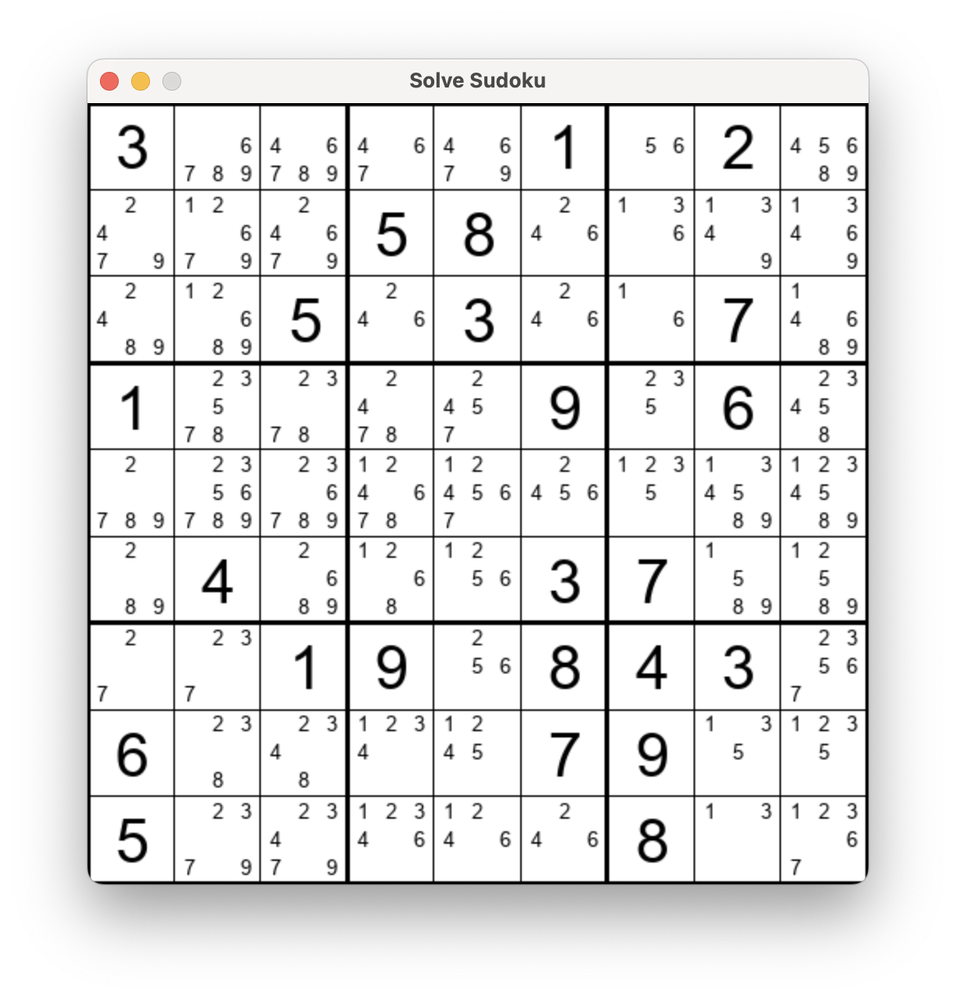

# Spatial Solver

Generic constraint solver based on state collapse.

[Video](https://www.youtube.com/watch?v=zSskltnm2YI)

[Video](https://www.youtube.com/watch?v=aOl-y7EOkps)

[Video](https://www.youtube.com/watch?v=aVtnLfdKUps)

## Usage

Fill plane with loops:

    python -m run loops

Solve sudoku (CLI, no animation):

    python -m run sudoku_mini data/sudoku/expert.txt

Solve sudoku (animated):

    python -m run sudoku data/sudoku/expert.txt

Attempt to fill plane with Wolfram rule 30:

    python -m run automata

## License

MIT
